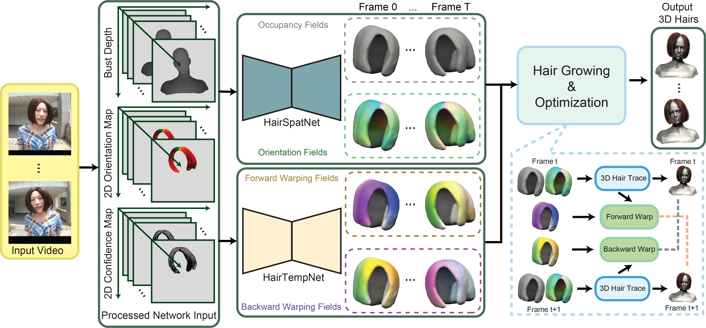

# Dynamic Hair Modeling
The source code of the networks for our paper "[Dynamic hair modeling from monocular videos using deep neural networks](http://kunzhou.net/2019/dynamic-hair-capture-sa19.pdf)" (SIGGRAPH ASIA 2019)

We propose a novel framework for dynamic hair modeling from monocular videos.
We use two networks **HairSpatNet** and **HairTempNet** to separately predict hair geometry and hair motion.
The entire framework is as follows:

<p align='center'>  
  
</p>

## Improvments
- For **HairSpatNet**, we removed instance normalization and the discriminator to speed up training process and reduce memory cost.
We found that the fine-grained details imposed by the discriminator would be obliterated by the space-time optimization afterwards.
- For motion prediction, we redesigned a network named **HairWarpNet** to directly predict flow based on the 3D fields (similar to the regression of optical flow). 
It is more reasonable and achieves better results than **HairTempNet**.
- There are more designs of **toVoxel** modules.
- You can check other research directions in folder OtherResearch.

## Prerequisites
- Linux
- Python 3.6
- NVIDIA GPU + CUDA 10.0 + cuDNN 7.5
- tensorflow-gpu 1.13.1


## Getting Started
- Conda installation:
    ```bash
    # 1. Create a conda virtual environment.
    conda create -n dhair python=3.6 -y
    conda activate dhair
    
    # 2. Install dependency
    pip install -r requirement.txt
    ```
- You can run the scripts in the Script folder to train/test your models.

## Related works
- The latest work [MonoHair](https://keyuwu-cs.github.io/MonoHair/)

- For single-view modeling [NeuralHDHair](https://github.com/KeyuWu-CS/NeuralHDHair)


## Citation

If you find this useful for your research, please cite the following papers.

```
@inproceedings{wu2022neuralhdhair,
title={NeuralHDHair: Automatic High-fidelity Hair Modeling from a Single Image Using Implicit Neural Representations},
author={Wu, Keyu and Ye, Yifan and Yang, Lingchen and Fu, Hongbo and Zhou, Kun and Zheng, Youyi},
booktitle={Proceedings of the IEEE/CVF Conference on Computer Vision and Pattern Recognition},
pages={1526--1535},
year={2022}
}

@article{yang2019dynamic,
  title={Dynamic hair modeling from monocular videos using deep neural networks},
  author={Yang, Lingchen and Shi, Zefeng and Zheng, Youyi and Zhou, Kun},
  journal={ACM Transactions on Graphics (TOG)},
  volume={38},
  number={6},
  pages={1--12},
  year={2019},
}
```
